<!-- ==================== ANIMATED COSMIC HUD COMMAND CONSOLE ==================== -->

  

<!-- ==================== DYNAMIC SUB-ORBITAL TYPING BANNER ==================== -->

  

<!-- ==================== MISSION CONTROL BADGES ==================== -->

  
  
  
  

---

### About Me

A results-driven **AI Engineer & Systems Developer** and Computer Science graduate from **Can Tho University (CTU)** specializing in multimodal deep learning architectures, foundation models, and low-latency system telemetry.

* **Core Focus**: Multimodal AI, Foundation Models, LLM Post-Training & Agentic Systems.
* **Architecture & R&D**: Vision-Language Models, Deep Neural Networks, Scalable Edge Telemetry.
* **Alignment & Safety**: RLHF Optimization, Data Annotation Protocols, Model Evaluation.
* **Systems Expertise**: Low-Latency Win32 Kernel APIs, High-Performance Python & Full-Stack Systems.
* **Academic Foundation**: Bachelor of Science in Computer Science, **Can Tho University** (GPA: **3.37 / 4.00**, 2021 – 2026).

---

### Technical Competencies

#### Neural Networks & Machine Learning

#### Core Engineering Languages

#### Systems & Web Frameworks

#### Telemetry, Databases & Cloud Tooling

---

### Flagship Project: OmniDeck

  

 

  
<b>OmniDeck Architecture & Telemetry Specifications</b> <i>(Click to expand/collapse)</i>

   

  * **Mission Profile**: Real-time Windows hardware telemetry engine and ultra-low latency transparent in-game HUD overlay engineered with an Apple Glassmorphism aesthetic.
  * **Propulsion & Architecture**: Tauri-level hybrid architecture uniting **React 18 + TailwindCSS + Framer Motion** with native **Python Win32 C-APIs & NVML kernel memory streams** (<0.5% CPU load).
  * **Sensor Arrays**: Universal auto-discovery across **Intel/AMD CPUs**, **NVIDIA/Radeon GPUs**, dual-fan cooling RPM telemetry, and Catmull-Rom spline real-time charting with interactive mouse-wheel zoom.
  * **Direct Access**: [Explore Source Code](https://github.com/Zeus-AIE/OmniDeck) • [Technical Documentation](https://github.com/Zeus-AIE/OmniDeck#readme)

---

### Selected Research & Engineering Work

  
<b>Research & Academic Archives</b> <i>(Click to expand/collapse)</i>

   

  * **Multimodal Action Step Segmentation in Cooking Videos**  
    *Context: Undergraduate Thesis — Can Tho University (CTU)*

  * **Medical Diagnosis & Treatment Recommendation Platform**  
    *Context: Can Tho University Software Center (CUSC)*

---

### Certifications & Accreditations

  
<b>Professional Credentials & Honors</b> <i>(Click to expand/collapse)</i>

   

  * **Aptis ESOL - B2** (English Proficiency Certificate) — *British Council (2026)*
  * **Google Cybersecurity Professional Certificate** — *Coursera (2024)*
  * **Google UX Design Professional Certificate** — *Coursera (2024)*
  * **Python Professional Certificate** — *Kaggle (2024)*
  * **Youth Union Cadre Training Program** — *Can Tho University (2023 – 2024)*

---

### GitHub Activity & Telemetry

  

---

**Deep Space Transmission & Inquiries**  
Email: [lathaihoa2003@gmail.com](mailto:lathaihoa2003@gmail.com) • Phone: `(+84) 0865 254 028` • Can Tho City, Vietnam

